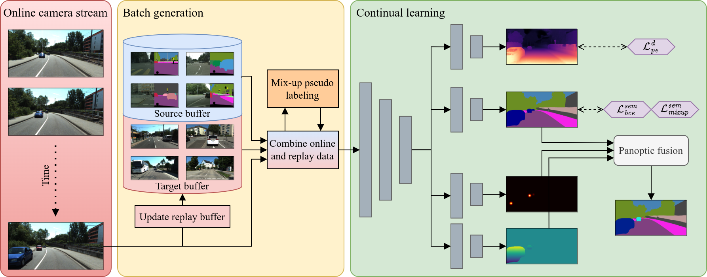

# CoDEPS
[**arXiv**](https://arxiv.org/abs/2303.10147) | [**Website**](http://codeps.cs.uni-freiburg.de/) | [**Video**](https://www.youtube.com/watch?v=4m4swaIkHyg)

This repository is the official implementation of the paper:

> **CoDEPS: Continual Learning for Depth Estimation and Panoptic Segmentation**
>
> [Niclas Vödisch](https://vniclas.github.io/), [Kürsat Petek](http://www2.informatik.uni-freiburg.de/~petek/), [Wolfram Burgard](http://www2.informatik.uni-freiburg.de/~burgard/), and [Abhinav Valada](https://rl.uni-freiburg.de/people/valada).
>
> *Robotics: Science and Systems (RSS)*, 2023

<p align="center">
  
</p>

If you find our work useful, please consider citing our paper:
```
@article{voedisch23codeps,
  title={CoDEPS: Online Continual Learning for Depth Estimation and Panoptic Segmentation},
  author={Vödisch, Niclas and Petek, Kürsat and Burgard, Wolfram and Valada, Abhinav},
  journal={Robotics: Science and Systems (RSS)},
  year={2023}
}
```


## 📔 Abstract

Operating a robot in the open world requires a high level of robustness with respect to previously unseen environments. Optimally, the robot is able to adapt by itself to new conditions without human supervision, e.g., automatically adjusting its perception system to changing lighting conditions. In this work, we address the task of continual learning for deep learning-based monocular depth estimation and panoptic segmentation in new environments in an online manner. We introduce CoDEPS to perform continual learning involving multiple real-world domains while mitigating catastrophic forgetting by leveraging experience replay. In particular, we propose a novel domain-mixing strategy to generate pseudo-labels to adapt panoptic segmentation. Furthermore, we explicitly address the limited storage capacity of robotic systems by proposing sampling strategies for constructing a fixed-size replay buffer based on rare semantic class sampling and image diversity. We perform extensive evaluations of CoDEPS on various real-world datasets demonstrating that it successfully adapts to unseen environments without sacrificing performance on previous domains while achieving state-of-the-art results.


## 🏗 Setup

### ⚙️ Installation

1. Create conda environment: `conda create --name codeps python=3.8`
2. Activate environment: `conda activate codeps`
3. Install dependencies: `pip install -r requirements.txt`


## 🏃 Running the Code

### Pretraining

The script file to pretrain CoDEPS can be found in `scripts/train.sh`. Before executing the script, make sure to adapt all parameters.

Additionally, ensure that the dataset path is set correctly in the corresponding config file, e.g., `cfg/train_cityscapes.yaml`.

**Note:** We also provide the pretrained model weights at this link: https://codeps.cs.uni-freiburg.de/downloads/cityscapes_pretrain.pth

### Online Continual Learning

To perform online continual learning, execute `scripts/adapt.sh`. Similar to the pretraining script, make sure to adapt all parameters before executing the script.

Additionally, ensure that the dataset path is set correctly in the corresponding config file, e.g., `cfg/adapt_cityscapes_kitti_360.yaml`.


## 💾 Data preparation

### Cityscapes

Download the following files:
- leftImg8bit_sequence_trainvaltest.zip (324GB)
- gtFine_trainvaltest.zip (241MB)
- camera_trainvaltest.zip (2MB)
- disparity_sequence_trainvaltest.zip (106GB) (optional)

Run `cp cityscapes_class_distribution.pkl CITYSCAPES_ROOT/class_distribution.pkl`, where `CITYSCAPES_ROOT` is the path to the extracted Cityscapes dataset.

After extraction, one should obtain the following file structure:
```
── cityscapes
   ├── camera
   │    └── ...
   ├── disparity_sequence
   │    └── ...
   ├── gtFine
   │    └── ...
   └── leftImg8bit_sequence
        └── ...
```

### KITTI-360

Download the following files:
- Perspective Images for Train & Val (128G): You can remove "01" in line 12 in `download_2d_perspective.sh` to only download the relevant images.
- Test Semantic (1.5G)
- Semantics (1.8G)
- Calibrations (3K)

After extraction and copying of the perspective images, one should obtain the following file structure:
```
── kitti_360
   ├── calibration
   │    ├── calib_cam_to_pose.txt
   │    └── ...
   ├── data_2d_raw
   │   ├── 2013_05_28_drive_0000_sync
   │   └── ...
   ├── data_2d_semantics
   │    └── train
   │        ├── 2013_05_28_drive_0000_sync
   │        └── ...
   └── data_2d_test
        ├── 2013_05_28_drive_0008_sync
        └── 2013_05_28_drive_0018_sync
```

### SemKITTI-DVPS

1. Download the annotations using the link from [semkitti-dvps](https://github.com/joe-siyuan-qiao/ViP-DeepLab/tree/master/semkitti-dvps).
2. Download the [KITTI odometry](http://www.cvlibs.net/datasets/kitti/eval_odometry.php) color images (65GB) and extract them to the same folder.
3. Execute our script to organize the data in accordance with the KITTI dataset:
`python scripts/prepare_sem_kitti_dvps.py --in_path IN_PATH --out_path OUT_PATH`

Afterwards, one should obtain the following file structure:
```
── sem_kitti_dvps
   ├── data_2d_raw
   │   ├── 01
   │   │   ├── image_2
   │   │   │   └── ...
   │   │   ├── calib.txt
   │   │   └── times.txt
   │   └── ...
   ├── data_2d_semantics
   │   ├── 01
   │   └── ...
   └── data_2d_depth
       ├── 01
       └── ...
```


## 👩‍⚖️  License

For academic usage, the code is released under the [GPLv3](https://www.gnu.org/licenses/gpl-3.0.en.html) license.
For any commercial purpose, please contact the authors.


## 🙏 Acknowledgment

This work was partly funded by the European Union’s Horizon 2020 research and innovation program under grant agreement No 871449-OpenDR and the Bundesministerium für Bildung und Forschung (BMBF) under grant agreement No FKZ 16ME0027.
<br><br>
<a href="https://opendr.eu/"></a>
